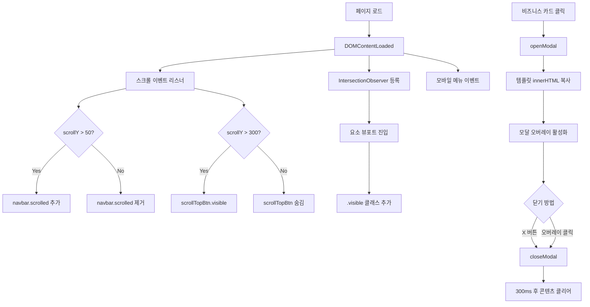

# On2Logic 웹사이트 코드베이스 딥 분석 (Deep Analysis)

## 1. 프로젝트 개요

**On2Logic**(`㈜온투로직`)은 Level-0 비즈니스 모델 기반의 **SoC(System-on-Chip) 전문 설계 회사**입니다. 이 프로젝트는 회사의 기업 소개 웹사이트로, **순수 HTML + CSS + JavaScript** 단일 페이지 애플리케이션(SPA)입니다.

| 항목 | 내용 |
|------|------|
| **기술 스택** | HTML5, Vanilla CSS, Vanilla JS |
| **프레임워크** | 없음 (프레임워크 미사용) |
| **폰트** | Google Fonts — Outfit (제목), Inter (본문) |
| **아이콘** | Phosphor Icons (CDN) |
| **디자인 테마** | 다크 모드, Glassmorphism, Cyan/Blue 그라데이션 |

---

## 2. 파일 구조

```
on2logic_web/
├── index.html              (351줄)  — 메인 HTML, 전체 페이지 구조
├── styles.css              (718줄)  — 전체 스타일시트
├── script.js               (102줄)  — 인터랙션 로직
├── project.md              (35줄)   — 이전 UI 개편 작업 이력
├── README.md               (34B)    — 프로젝트 설명 (미니멀)
└── assets/
    ├── hero-bg.png                  — 히어로 섹션 배경 이미지
    ├── about_us_soc.png             — About Us 카드 내 SoC 컨셉 이미지
    ├── 온투로직-로고원본화일.avif      — 회사 공식 로고 (AVIF)
    ├── 현판1_edited.avif            — DIPS 1000+ 현판 사진 1
    └── 현판2_edited.avif            — DIPS 1000+ 현판 사진 2
```

---

## 3. 페이지 섹션별 구조 (index.html)

### 3.1 `<head>` (L1–L17)
- Google Fonts 프리커넥트 + Outfit/Inter 로드
- Phosphor Icons CDN (`unpkg.com`)
- `styles.css` 링크

### 3.2 배경 효과 (L20–L22)
- 두 개의 `.bg-glow` div로 **고정 위치(fixed)** 그라데이션 원형 블러 효과 생성
  - `.bg-glow-1`: 좌상단, 파란색 계열 (50vw 크기)
  - `.bg-glow-2`: 우하단, 시안색 계열 (40vw 크기)
- `z-index: -1`로 모든 콘텐츠 뒤에 위치

### 3.3 내비게이션 바 (L24–L46)
- **Fixed 헤더** — 스크롤 시 상단 고정
- 좌측: 회사 로고 이미지 (`<a>` 태그로 감싸 클릭 시 최상단 이동)
- 우측: Company, Business, Contact Us 링크 3개
- **모바일 메뉴 버튼**: `display: none`이 기본, 768px 이하에서 나타남
- **모바일 내비게이션 오버레이**: 풀스크린, 우측에서 슬라이드 인

### 3.4 히어로 섹션 (L48–L60)
- 풀 뷰포트 높이 (`min-height: 100vh`)
- 배경: `hero-bg.png`에 150% 크기로 확대 + CSS `@keyframes panBg`로 **30초 좌우 패닝 애니메이션**
- `::before` 의사 요소로 어두운 그라데이션 오버레이 적용
- 제목: "Advancing System Semiconductors **with On2Logic**" — "with On2Logic" 부분에 `.text-gradient` (시안색 그라데이션)
- 서브타이틀: Level-0 비즈니스 모델 설명
- CTA 버튼 2개: `[Our Story]` → #about, `[Explore Solutions]` → #business

### 3.5 About On2Logic 섹션 (L62–L119)
`.about-grid` 레이아웃 (3열 × 2행 그리드):

| 카드 | 위치 | 내용 |
|------|------|------|
| **ABOUT US** | 좌측 2열 × 2행 (`span 2`) | 회사 소개 텍스트 + SoC 컨셉 이미지 |
| **Expert** | 우측 상단 1칸 | SoC 업계 전문가 팀 소개 |
| **DIPS 1000+** | 우측 하단 1칸 | 2024 중기부 선정 인증 → **클릭 시 모달** |

- DIPS 카드는 `.highlight-card` + `.glow-on-hover` 클래스로 특별한 배경/보더 스타일 적용
- DIPS 모달(`#modal-dips`): 현판 이미지 2장을 세로로 나열

### 3.6 Core Business Areas 섹션 (L121–L260)
`.business-grid` (3열 그리드) — **각 카드 클릭 시 모달 팝업**:

#### 카드 1: SoC Design (`#modal-soc`)
- 아이콘: `ph-circuitry`
- 모달 내 4개 하위 영역:
  - **IDEA to RTL**: 사양 정의, 시스템 아키텍처, IP 설계, 저전력/고성능
  - **Design Verification**: 시스템 레벨 검증, 평가 보드, 펌웨어
  - **FPGA / ASIC**: 프로토타입, HW 검증, IP 성능 평가
  - **Turnkey Service**: 백엔드 설계, 파운드리, OSAT, SCM

#### 카드 2: Platform (`#modal-platform`)
- 아이콘: `ph-faders`
- 모달 내 2개 하위 영역:
  - **CPU Subsystem**: ARM Cortex M/R/A, RISC-V, 시스템 통합
  - **HW+SW Development**: 펌웨어, 디바이스 드라이버, OS 포팅, BSP/SDK

#### 카드 3: DFT (`#modal-dft`)
- 아이콘: `ph-shield-check`
- 모달 내 1개 풀 너비 항목:
  - **Automotive SoC Platform with IST**: 자율주행 ADAS 칩을 위한 IST 기술

### 3.7 Why On2Logic 섹션 (L262–L295)
`.glass-card` 안에 3개 강점 나열:

| # | 제목 | 설명 |
|---|------|------|
| 01 | Strong Network | SoC 산업 생태계 네트워크 |
| 02 | Deep Understanding | SoC 시스템 아키텍처 전문성 |
| 03 | Exceptional Service | 전문가 팀의 품질/지원 |

- 번호는 `3.5rem` 크기, 투명 텍스트 + 1px 스트로크 처리

### 3.8 Footer (L297–L329)
- 회사명: `㈜온투로직 ( On2Logic Co., Ltd. )`
- 연락처: 전화 (`tel:` 링크), 이메일 (`mailto:` 링크), 주소 (네이버 지도 링크)
- 모든 연락처에 **hover 시 시안색(#00e1ff)** 효과 적용 (인라인 JS)
- 하단 저작권: `© 2024 On2Logic. All rights reserved.`

### 3.9 모달 컨테이너 (L331–L341)
- 공통 모달 오버레이 (`#info-modal`) — 재사용 구조
- 닫기 버튼 (`modal-close`) + 콘텐츠 영역 (`#modal-content-area`)
- 콘텐츠는 JS `innerHTML` 주입으로 동적 교체

### 3.10 스크롤 최상단 버튼 (L343–L346)
- 우측 하단 플로팅 원형 버튼 (65px)
- 300px 이상 스크롤 시 fade-in

---

## 4. JavaScript 동작 분석 (script.js)

### 4.1 내비바 스크롤 효과 (L2–L11)
```
scroll > 50px → navbar.classList.add('scrolled')
→ 배경 반투명 + backdrop-filter 블러 + 하단 보더 추가
```

### 4.2 모바일 메뉴 토글 (L13–L34)
- 햄버거 버튼 클릭 시 `.mobile-nav.active` 토글
- 아이콘 `ph-list ↔ ph-x` 전환
- 모바일 링크 클릭 시 자동으로 메뉴 닫힘

### 4.3 스크롤 리빌 애니메이션 (L36–L55)
- `IntersectionObserver` 기반 — 뷰포트에 15% 진입 시 `.visible` 클래스 추가
- `rootMargin: "0px 0px -50px 0px"` — 하단 50px 여유
- **한 번만** 동작 (unobserve)
- 적용 대상: `.reveal-on-scroll` 클래스가 있는 모든 요소 (Hero, About, Business, Strengths)

### 4.4 스크롤 최상단 버튼 (L56–L72)
- 스크롤 300px 초과 시 버튼 표시 (`visible` 클래스)
- 클릭 시 `scrollTo({ top: 0, behavior: 'smooth' })`

### 4.5 모달 시스템 (L75–L101)
```js
openModal(templateId)
 → document.getElementById(templateId).innerHTML을 모달 영역에 주입
 → overlay에 'active' 클래스 추가
 → body overflow: hidden (배경 스크롤 방지)

closeModal()
 → 'active' 제거
 → 300ms 딜레이 후 innerHTML 비우기 (트랜지션 대기)
 → body overflow 복원

overlay 클릭 시 → e.target === modalOverlay이면 closeModal()
```

> [!IMPORTANT]
> 모달 내용은 HTML에 `display: none`으로 숨겨둔 `<div>` 템플릿에서 `innerHTML`을 복사하는 패턴입니다. 각 비즈니스 카드와 DIPS 카드 내부에 숨겨진 `.modal-content-data` div가 있으며, 카드 `onclick`에서 해당 div의 id를 `openModal()`에 전달합니다.

---

## 5. CSS 디자인 시스템 분석 (styles.css)

### 5.1 디자인 토큰 (CSS Variables)
| 변수 | 값 | 용도 |
|------|-----|------|
| `--bg-dark` | `#07090F` | 전체 배경 (거의 검은색) |
| `--bg-card` | `rgba(16,21,35,0.6)` | 카드 배경 (반투명) |
| `--border-card` | `rgba(255,255,255,0.08)` | 카드 보더 |
| `--text-main` | `#E2E8F0` | 주 텍스트 색 |
| `--text-muted` | `#94A3B8` | 보조 텍스트 색 |
| `--primary` | `#00E1FF` | 주요 색상 (Cyan) |
| `--secondary` | `#3B82F6` | 보조 색상 (Blue) |

### 5.2 핵심 디자인 패턴

1. **Glassmorphism**: `.glass-card` — 반투명 배경 + `backdrop-filter: blur(12px)` + 미세한 보더
2. **Glow 효과**: `.glow-on-hover` — hover 시 시안 보더 + 그림자 + 카드 상승
3. **텍스트 그라데이션**: `.text-gradient` — 흰색→시안 그라데이션 텍스트
4. **스크롤 리빌**: `.reveal-on-scroll` — 30px 아래에서 fade-in 슬라이드 업
5. **배경 패닝**: 히어로 배경 이미지가 30초 주기로 좌우 이동

### 5.3 반응형 브레이크포인트

| 브레이크포인트 | 변경 사항 |
|---------------|-----------|
| **≤ 992px** | About 그리드 → 단일 열, Business 그리드 → 2열, Strengths → 2열 |
| **≤ 768px** | 데스크톱 nav 숨김 + 모바일 버튼 표시, 버튼 100% 너비, Business/Strengths → 1열 |

### 5.4 특수 스타일 요소
- **모달**: `opacity: 0` + `pointer-events: none` 기본, `.active` 시 전환 + 스케일 애니메이션
- **스크롤 최상단 버튼**: 65px 원형, 시안 배경, hover 시 흰색 전환 + 상승
- **히어로 오버레이**: `::before`로 좌측 진한 → 우측 연한 그라데이션 적용

---

## 6. 데이터 플로우 및 인터랙션 맵



---

## 7. 주요 설계 특징 요약

1. **프레임워크 없는 순수 구현**: 빌드 도구, 번들러, 패키지 매니저 없이 3개 파일(HTML/CSS/JS)만으로 구성
2. **Glassmorphism 다크 테마**: 현대적이고 프리미엄한 반도체 회사 이미지에 적합한 디자인
3. **모달 템플릿 패턴**: 카드 내부에 숨겨진 HTML을 `innerHTML`로 주입하는 간단한 패턴
4. **IntersectionObserver 리빌**: 성능 효율적인 스크롤 애니메이션
5. **완전 반응형**: 992px, 768px 두 단계 브레이크포인트
6. **접근성 고려**: 모바일 메뉴 버튼에 `aria-label`, `tel:` / `mailto:` 링크, 의미론적 HTML 구조
7. **한국어/영어 혼용**: UI 텍스트는 영어, 에셋 파일명은 한국어, 프로젝트 문서는 한국어
